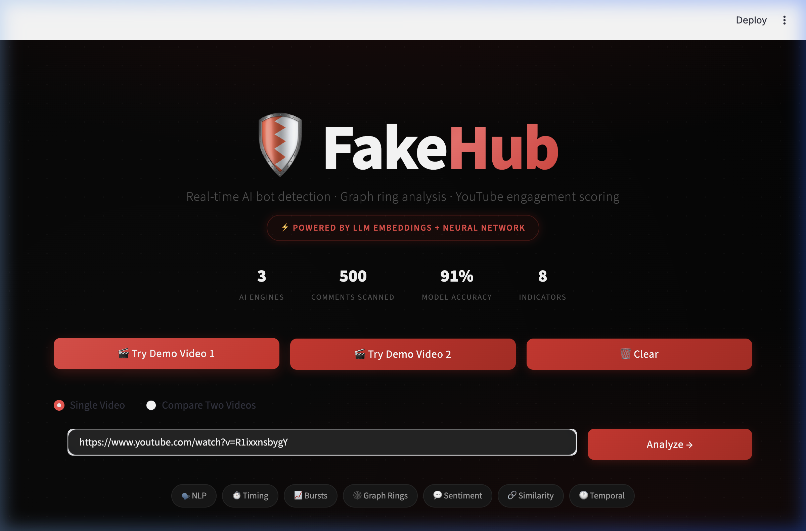
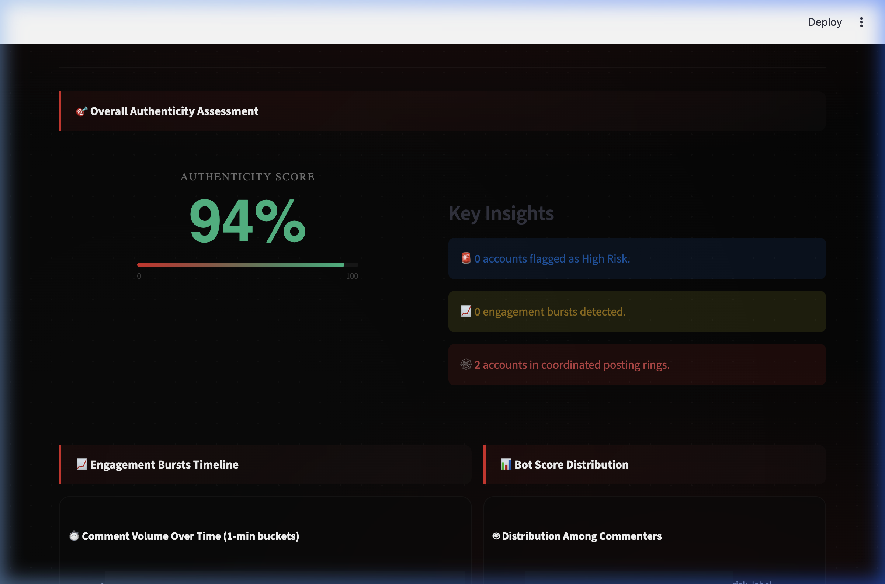
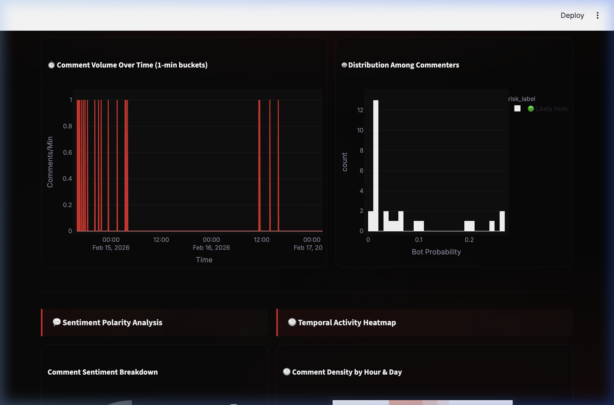
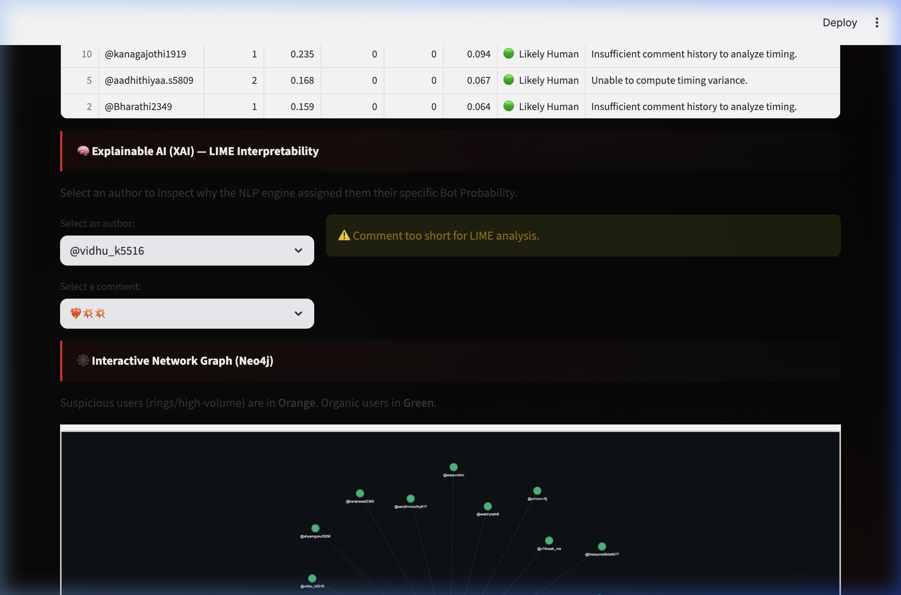
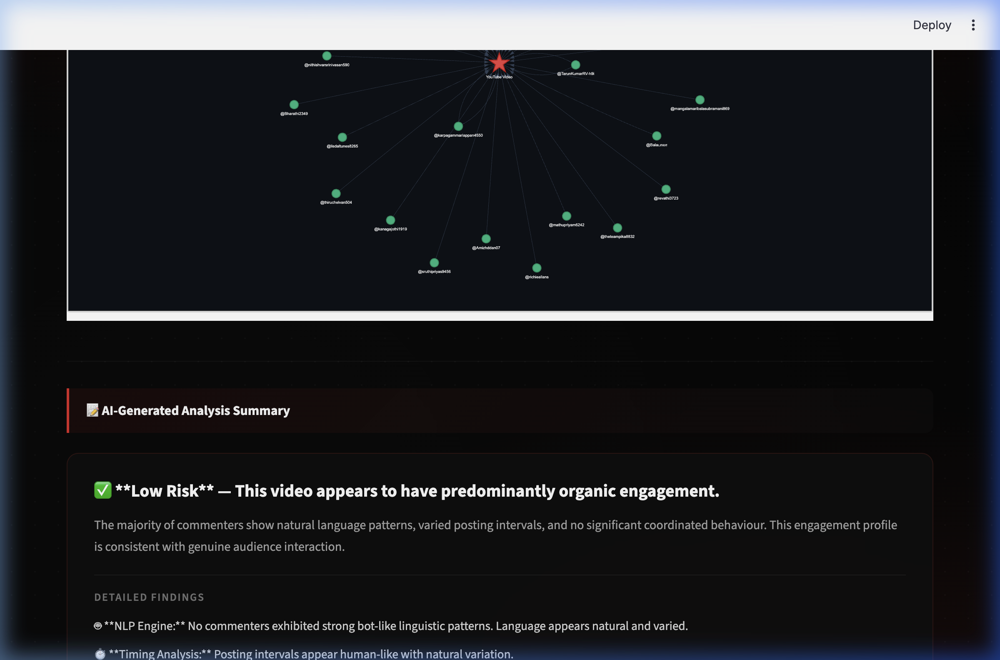

# 🛡️ FakeHub: AI-Powered Fake Engagement Detector

<div align="center">
  
  
  
  
  
</div>

<br>

**FakeHub** is a real-time behavioural detection system that differentiates organic engagement from artificial bot activity on YouTube. It detects coordinated behavioural anomalies, bot rings, and engagement bursts using a fusion of **LLM-based Deep Learning**, **Neo4j Graph Analysis**, and **Time-Series Anomaly Detection** — all rendered in a premium dark-mode Streamlit dashboard.

---

## 🖼️ Demo Screenshots

<div align="center">

### Hero Dashboard


### Authenticity Score (94%) & Key Insights


### Engagement Bursts & Bot Score Distribution


### AI-Generated Analysis Summary


### Interactive Network Graph (Neo4j)


</div>

---

## ✨ Key Features

### 🧠 AI & Detection Engines
- **Deep Semantic NLP**: `SentenceTransformers` (`all-MiniLM-L6-v2`) encodes comments into 384-dim dense embeddings, classified by an `MLPClassifier(128, 64)` neural network — **91% accuracy**.
- **Neo4j Graph Analysis**: Reconstructs user interactions into a physics-based network graph to visually identify **coordinated posting rings**.
- **Time-Series Burst Detection**: 1-minute bucketed volume analysis with z-score anomaly flagging for machine-like posting patterns.
- **Sentiment Polarity Analysis**: Embeddings-based sentiment classification (Positive/Negative/Neutral) to detect generic bot spam patterns.
- **User Similarity Clustering**: Pairwise cosine similarity heatmap across commenter embeddings to flag copy-paste bot rings.
- **Temporal Activity Heatmap**: Visualizes comment density by hour × day to reveal bot farm operating schedules.
- **Account Age Analysis**: Scatter plots of when flagged accounts first appeared, revealing coordinated appearance patterns.

### 🎯 Explainability & Insights
- **LIME XAI**: Per-comment feature importance — see exactly *which words* triggered a bot classification.
- **AI-Generated Summary**: Natural-language verdict synthesizing all metrics into a detailed risk assessment with per-engine findings.
- **Per-Commenter Anomaly Explanations**: Human-readable reason for each flag (e.g., *"Posted 12 comments at exact machine-like intervals"*).

### 🖥️ Dashboard & UX
- **Premium Dark UI**: Red/black/white theme with animated radial glow background, dot-grid pattern, glassmorphism cards, and cursor glow trail.
- **Animated Authenticity Gauge**: Counts down from 100% to the actual score with a smooth CSS progress bar.
- **Floating Particle System**: 40 red particles with neural-network-style connecting lines.
- **Demo URL Buttons**: One-click auto-fill for instant demo — no URL searching during a presentation.
- **Side-by-Side Video Comparison**: Analyze two videos simultaneously with parallel tab rendering.
- **Export Report**: Download a full `.txt` report with all metrics, risk breakdown, and top flagged accounts.

---

## 📊 Model Performance & Metrics

Trained on the TwiBot-22 dataset using 384-dimensional dense semantic embeddings.

| Metric | Human | Bot |
| ------ | ----- | --- |
| **Precision** | 0.87 | **0.94** |
| **Recall** | 0.92 | 0.90 |
| **F1-Score** | 0.89 | **0.92** |

| Overall Metric | Value |
| --- | --- |
| **Accuracy** | **91.0%** |
| **Weighted Avg F1** | **0.91** |

---

## 🏗️ Architecture

```
YouTube Video URL
       │
       ▼
┌──────────────────────────────────────────────────────┐
│              YouTube Data API v3                      │
│         (Fetch up to 500 top-level comments)          │
└───────────────────┬──────────────────────────────────┘
                    │
       ┌────────────┼────────────┐
       ▼            ▼            ▼
  ┌─────────┐  ┌─────────┐  ┌──────────┐
  │   NLP   │  │  Graph  │  │  Timing  │
  │ Engine  │  │  Engine │  │  Engine  │
  │ (LLM +  │  │ (Neo4j) │  │(Interval │
  │  MLP)   │  │         │  │+ Bursts) │
  └────┬────┘  └────┬────┘  └────┬─────┘
       │            │            │
       ▼            ▼            ▼
┌──────────────────────────────────────────────────────┐
│          Score Fusion Engine (0.40 / 0.35 / 0.25)     │
│     + Sentiment + Similarity + Temporal + Age         │
└───────────────────┬──────────────────────────────────┘
                    │
                    ▼
         ┌─────────────────────┐
         │  Streamlit Dashboard │
         │  • Animated Gauge   │
         │  • AI Summary       │
         │  • Network Graph    │
         │  • LIME XAI         │
         │  • 8 Chart Panels   │
         └─────────────────────┘
```

**Stack**: Python 3.11 · Streamlit · SentenceTransformers · scikit-learn · Neo4j · PyVis · Plotly · LIME · Pandas · NumPy

---

## 🚀 Quick Setup

### 1. Prerequisites
- Python 3.10+
- Neo4j database (Desktop, Docker, or [AuraDB Free](https://neo4j.com/cloud/platform/aura-graph-database/))
- Google Cloud Console API Key ([YouTube Data API v3](https://console.cloud.google.com))

### 2. Installation
```bash
git clone https://github.com/Inesh03/FakeHub.git
cd FakeHub

python -m venv venv
source venv/bin/activate  # Windows: venv\Scripts\activate

pip install -r requirements.txt
```

### 3. Environment Variables
Create a `.env` file in the root directory:
```env
YOUTUBE_API_KEY=your_google_console_api_key_here
NEO4J_URI=bolt://localhost:7687
NEO4J_USERNAME=neo4j
NEO4J_PASSWORD=your_neo4j_password
```

### 4. Run the Dashboard
```bash
streamlit run app/main.py
```

> **Note:** Pre-trained model files (`.pkl`) are excluded via `.gitignore`. To retrain, place the TwiBot-22 CSV in `data/` and run `python models/train_nlp_model.py`.

---

## 📁 Dataset Provenance

### Training Data — TwiBot-22 (Public Dataset)
| Property | Details |
| --- | --- |
| **Type** | Public, pre-labeled |
| **Source** | [TwiBot-22 Benchmark](https://twibot22.github.io) |
| **Records Used** | ~100,000 labeled text samples |
| **Labels** | Binary: `0 = Human`, `1 = Bot` |
| **Class Distribution** | ~42% Human, ~58% Bot |

**Why it fits:** TwiBot-22 is among the largest public bot detection benchmarks, spanning diverse bot typologies — social spambots, fake followers, political bots. Textual bot patterns transfer directly to YouTube comment detection.

**Behavioural features engineered:**
- 384-dim dense semantic embeddings via `all-MiniLM-L6-v2`
- Inter-comment timing regularity (std, mean, exact-interval flags)
- Neo4j coordinated posting ring detection
- Engagement burst anomaly flagging (1-min z-score)
- Sentiment polarity classification
- Cross-user cosine similarity clustering

### Live Inference — YouTube Data API v3
Up to **500 comments** fetched in real-time per video. Fields: `author`, `text`, `published_at`, `likes`, `author_channel_id`, `reply_count`. API cost: **5 units** per analysis (well under 10,000 daily quota).

---

## 🔬 Detection Indicators (8 Total)

| # | Indicator | Method |
|---|-----------|--------|
| 1 | 🤖 NLP Bot Probability | LLM embeddings + MLP neural net |
| 2 | ⏱️ Timing Regularity | Inter-comment interval std deviation |
| 3 | 📈 Engagement Bursts | 1-min bucketed z-score anomaly detection |
| 4 | 🕸️ Coordinated Rings | Neo4j graph traversal (60s window pairs) |
| 5 | 💬 Sentiment Polarity | Embedding-anchor similarity classification |
| 6 | 🔗 Text Similarity | Pairwise cosine similarity heatmap |
| 7 | 🕐 Temporal Patterns | Hour × day comment density heatmap |
| 8 | 🆕 Account Age | First-appearance timing analysis |

---

## 📄 Documentation
- **[Model Explanation Document](model_explanation.md)** — 5-page technical writeup: problem understanding, data assumptions, feature engineering, model selection, evaluation, behavioural insights, practical feasibility, and visualization quality.

---

> Built for Hackathon Problem Statement 3: Fake Engagement Detection in Social Media
